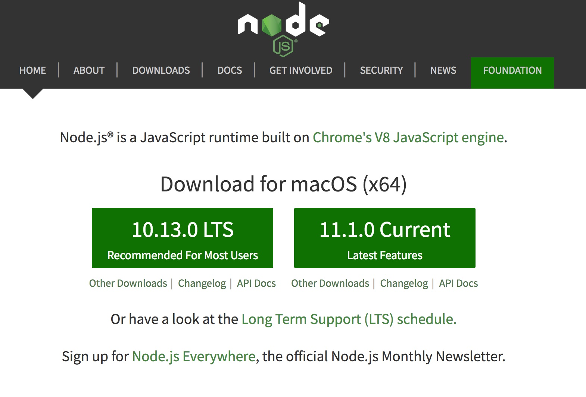

# 开发环境配置

在使用小程序云开发进行小程序开发时，你需要安装两个工具来帮助你完成开发工作：Node.js 环境 和 小程序开发工具。由于官方仅提供了 Windows 和 macOS 的开发工具，因此，后续的说明也仅提供 Windows 和 macOS 的版本。

### Node.js

Node.js 的安装有多种方式，不过考虑到我们仅仅是用其作为开发的辅助，并不需要多个版本的管理和控制的能力，Windows 下我们使用官方的安装包，macOS 下我们可以使用 Homebrew 来安装 Node.js。

#### Windows

Windows 下我们可以直接使用官方的安装包。

访问 Node.js 官网 nodejs.org，下载左侧的 **LTS 版本**的安装包。



下载完成后，点击安装，一路 Next 即可。

安装完成后，打开 cmd 或 Power shell ，执行一下 `node -v`看下能否输出正确的版本号，如果可以正确输出，则说明安装完成。

#### macOS

macOS 下的安装要简单一点，直接使用 homebrew 来安装即可。

如果你还没有安装 Homebrew ，可以打开系统自带的**终端**或你自己安装的终端工具执行如下命令来安装

```bash
/usr/bin/ruby -e "$(curl -fsSL https://raw.githubusercontent.com/Homebrew/install/master/install)"
```

安装完成后，执行

```bash
brew install node
```

### 微信小程序开发工具

微信小程序开发工具的安装渠道非常单一，仅推荐使用官方的安装方式。

官方下载地址：https://developers.weixin.qq.com/miniprogram/dev/devtools/download.html