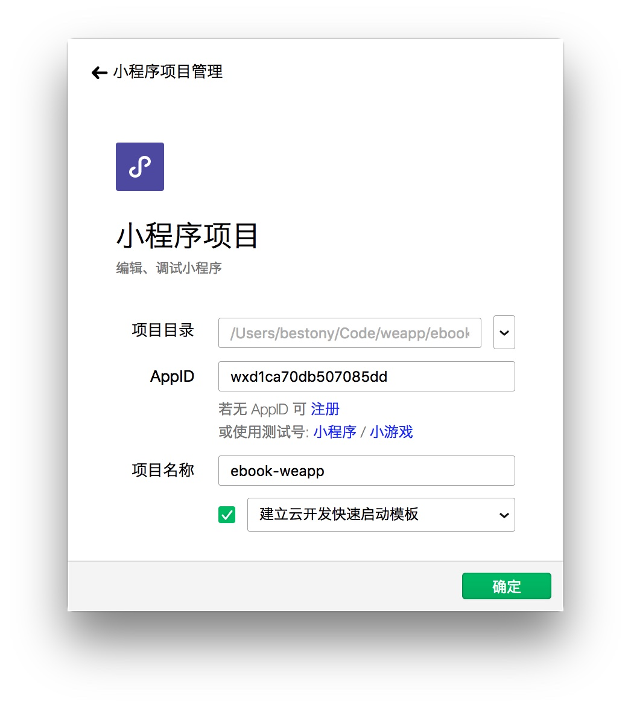
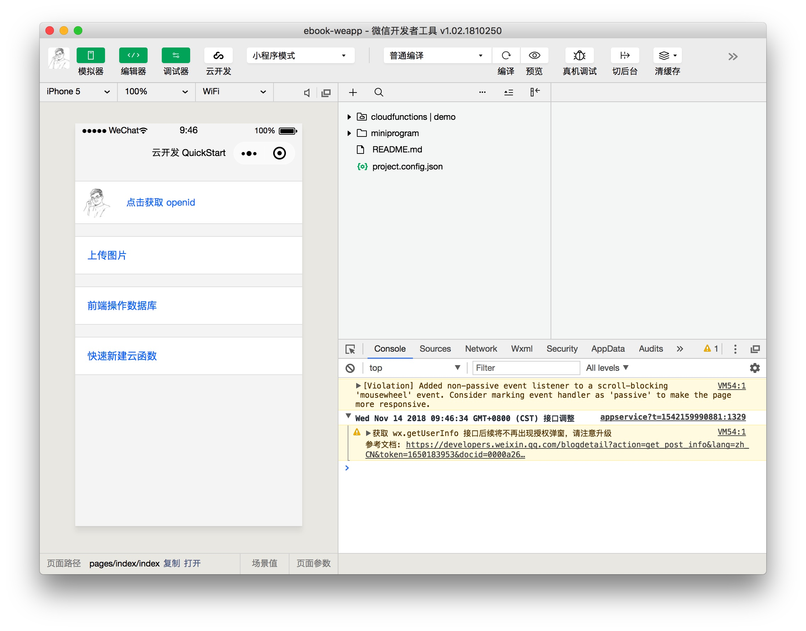

# 创建一个云开发项目

当你完成了开发环境的配置后，接下来，我们来初始化一个云开发项目。

## 提前准备

由于云开发和小程序绑定，因此， 云开发无法使用微信所给的测试账号进行开发，必须使用自己的小程序账号进行开发。你需要在开始前，注册一个小程序的账号。

## 创建项目

当你已经有了小程序的账号后，就可以开始创建云开发项目了。

打开的你的微信开发者工具，选择「**小程序项目**」。

并在新的界面中点击右下角的**加号**，新建一个项目。

选择一个空白目录，填入你的小程序 AppID，并输入项目名称。在下方的列表中选择「建立云开发快速启动模板」。

然后点击**确定**，就完成了模板的创建工作。

## 开通云开发

【开通云开发的界面】

点击上方的「云开发」按钮，会自动进入到云开发的开通界面，开通云开发。

【新建环境的界面】

并创建一个新的云开发环境。

这样，就完成了云开发的开通操作。
