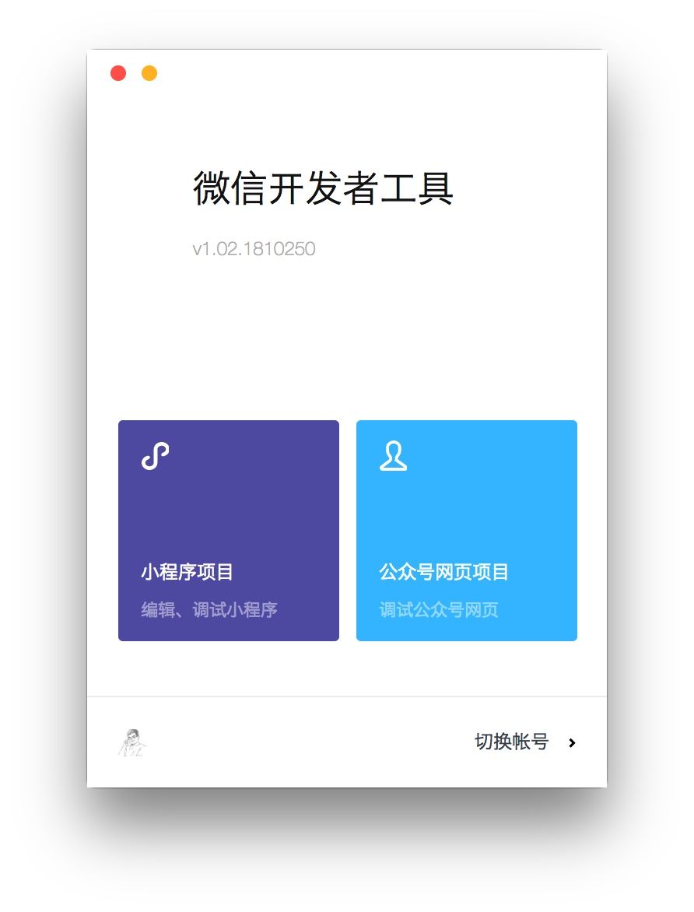
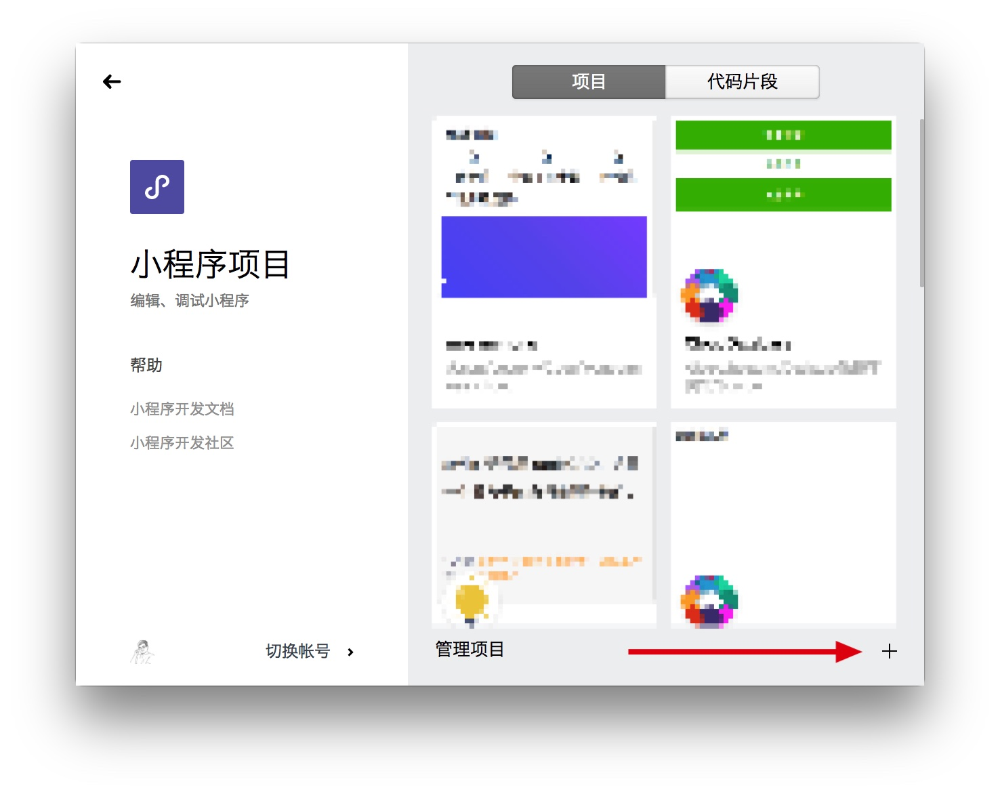

# 创建一个云开发项目

当你完成了开发环境的配置后，接下来，我们来初始化一个云开发项目。

## 提前准备

由于云开发和小程序绑定，因此， 云开发无法使用微信所给的测试账号进行开发，必须使用自己的小程序账号进行开发。你需要在开始前，注册一个小程序的账号。

## 创建项目

当你已经有了小程序的账号后，就可以开始创建云开发项目了。

打开的你的微信开发者工具，选择「**小程序项目**」。

并在新的界面中点击右下角的**加号**，新建一个项目。

